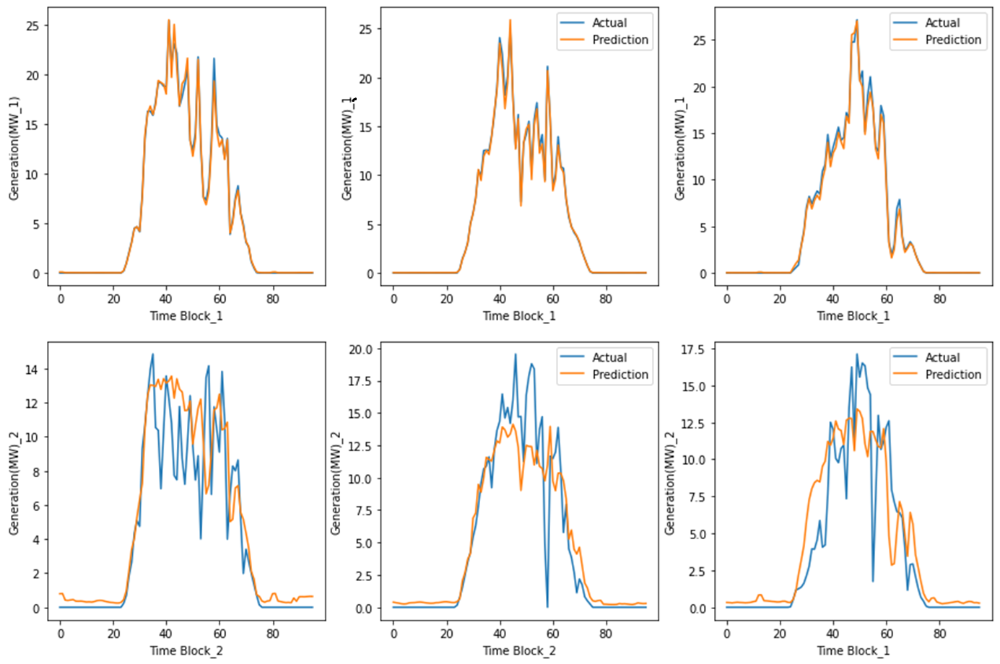

# Solar Power Forecasting using Machine Learning and Deep Learning

Welcome to the Gandikota Solar Power Forecasting Tool, developed as part of my M.Tech thesis. This project leverages machine learning and deep learning techniques to forecast solar power generation and is deployed using Streamlit for an interactive user experience.

## Overview

The primary objective of this project is to accurately predict the power output of a solar plant for future time blocks, facilitating optimized resource allocation and production planning. The tool offers the following features:

- **Forecast Generation**: Predicts solar power output for upcoming time blocks based on historical data and weather forecasts.
- **Forecast Analysis**: Provides visualizations and metrics to assess the accuracy and reliability of the predictions.
- **Historical Data Loading**: Allows users to load and compare actual and predicted data from previous days.
- **User Feedback**: Includes a comment section for users to record observations and provide feedback.

## Features

- **Machine Learning Models**: Implements Gradient Boosting, Random Forest, and Deep Neural Networks to enhance forecasting accuracy.
- **Data Processing Pipelines**: Utilizes Python-based pipelines for efficient data handling and preprocessing.
- **Advanced Imputation Techniques**: Applies methods like Linear Regression, KNN, and MICE to address missing data and improve model performance.
- **Interactive Visualizations**: Employs Streamlit and Power BI dashboards for comprehensive exploratory data analysis (EDA) and result presentation.

## Installation

To run this project locally, follow these steps:

1. **Clone the repository**:

   ```bash
   git clone https://github.com/udaybhaskar717/Gandikota_Solar_Power_Forecasting_Tool.git
   cd Gandikota_Solar_Power_Forecasting_Tool
   ```

2. **Install the required dependencies**:

   Ensure you have Python installed, then run:

   ```bash
   pip install -r requirements.txt
   ```

3. **Run the Streamlit application**:

   ```bash
   streamlit run solar_app.py
   ```

   The application should now be accessible at `http://localhost:8501`.

## Usage

Upon launching the application, you can:

- **Generate Forecasts**: Input the necessary parameters to produce solar power forecasts for desired time blocks.
- **Analyze Forecasts**: View graphical representations and statistical metrics to evaluate forecast performance.
- **Load Historical Data**: Upload previous days' actual and predicted data to compare and analyze discrepancies.
- **Provide Feedback**: Use the comment section to document insights, observations, or suggestions for improvement.

## Dataset

The model training and evaluation utilize historical solar power generation data and corresponding weather information. Due to confidentiality agreements, the dataset is not included in this repository. However, the code is structured to accommodate similar datasets; users can modify the data loading functions to suit their data sources.

## Model Performance

The implemented models have demonstrated a Root Mean Square Error (RMSE) of 0.43 W/m², indicating high accuracy in predicting solar power output. This performance metric underscores the effectiveness of the chosen algorithms and preprocessing techniques.

### Results

The forecasting results are visualized below to illustrate the model's performance:

- **Actual vs Predicted Power Output**:

  

- **Error Distribution**:

  

- **Power Output Trends**:

  

These plots demonstrate the model's capability to closely match actual values and highlight areas for further refinement.

## Future Work

Potential enhancements for this project include:

- **Integration of Real-Time Weather Data**: Incorporating live weather forecasts to improve prediction accuracy.
- **Model Optimization**: Experimenting with hyperparameter tuning and alternative algorithms to further reduce prediction errors.
- **User Interface Improvements**: Enhancing the Streamlit interface for better user experience and accessibility.

## Contributing

Contributions to this project are welcome. Feel free to fork the repository, create feature branches, and submit pull requests for review.

## License

This project is licensed under the MIT License. See the [LICENSE](LICENSE) file for details.

## Acknowledgments

I would like to express my gratitude to my academic advisors and peers for their guidance and support throughout this project. Special thanks to the developers of the open-source libraries and tools that made this work possible.

---

For any inquiries or further information, please contact [Your Name] at [Your Email Address].
